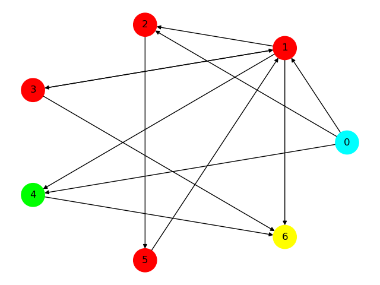

# Project 4

## Task 1 - Generating random graphs and displaying their forms

The program allows user to:
- generate random graph 
- print other forms (adjacency list, incidence matrix, visual version) of a graph given in specified input file

In both cases user can supress output by using a flag. In second case it would lead to printing only visual version of a graph and in first case it would lead additionaly to saving the file to `InputFiles/task1_output.txt`. 

### 1.1 How to run the program

`python3 task1.py number_of_vertices probability [-n]`  
In this case, without using a `-n` flag, user will be shown all of the forms of randomly generated graph, graph will be displayed and saved to `InputFiles/task1_output.txt` for future use.
When `-n` flag is used, the same thing will happen except for showing other forms of the graph in the console. 

`python3 task1.py path_to_file [-n]`
In this case, without using a `-n` flag, user will be shown all of the forms of the graph generated from file specified by `path_to_file` and graph will be displayed to user.
When `-n` flag is used, the same thing will happen except for showing other forms of the graph in the console. 


## Task 2 - Strongly Connected Components

The program allows the user to find strongly connected components in digraph using Kosaraju algorithm and coloring up to 13 different components (when that number is exceeded, program displays warning that components will not be presented graphically (with colors)).

### 2.1 How to run the program

`python3 task2.py <path to file>`

where `<path to file>` contains location of adjacency matrix representing digraph 

### 2.2 Example:

`python3 task2.py .\InputFiles\input2.txt` returns result:



```
Component number 1 - vertices: 0
Component number 2 - vertices: 1  2  3  5
Component number 3 - vertices: 4
Component number 4 - vertices: 6
The number of components in this graph: 4
```


## Task 3 - Random Strongly Connected Components Digraph and Bellman-Ford's algorithm

The program generates random complement digraph 
and runs Bellman-Ford algorithm on it to find all shortest paths to each vertex starting from chosen vertex.

### 3.1 How to run the program

`python3 task3.py [max_vertices_number source_vertex]`

- max_vertices_number - program will generate digraph with max this number of vertices
- source_vertex - source for Bellman-Ford

or

`python3 task3.py [file_path]`

- file_path - path to file with graph data

## Task 4 - Johnson's algorithm
 
The program allows user to generate a distance matrix between each two vertices, that works on digraphs that are both positively and negatively weighted.
 
### 4.1 How to run the program

The command depends on whether you want to: 

- Generate a digraph:

`python3 task4.py [max_vertices_number]`

- Import a digraph from file:

`python3 task4.py -f <path to file>`

Where:
- `[max_vertices_num]` is the maximum amount of vertices that could be generated in the digraph,
- `<path to file>` is the path to the file containing digraph in form of a [weighted matrix](https://github.com/nerooc/graphs/blob/main/Lab04/InputFiles/johnson_test.txt) where **dots** represent no edge between vertices.

### 4.2 Testing
 
`python3 task4.py test`
 
The test contains the function calls for:
 
- **#1 - Hardcoded matrix**, <br/>
```
.  .  3  .  1
1  .  1 -1  1
1  0  .  .  1
.  .  .  .  0
.  1  ,  1  0
```
