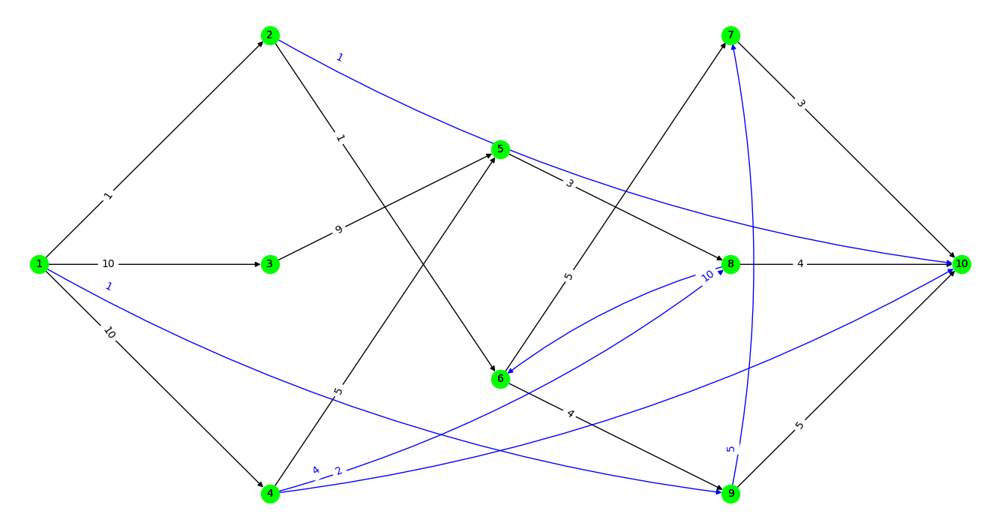

# Project 5

## Task 1 - Generating random flow net

The program allows user to :
- generate random flow net
- display result graph 
- display and save its adjacency matrix to the txt file (`InputFiles/task1_output.txt`).

### 1.1 How to run the program

`python3 task1.py [-h] -l LAYERS [-vn VERTICES_NUMBERS [VERTICES_NUMBERS ...]]`

where:
- `LAYERS` is required integer argument representing number of middle layers (without first layer - source, and the last one - sink) of a flow net
- `VERTICES_NUMBERS` is optional list argument containing numbers of vertices corresponding to number of vertices in each of middle layers. Unless provided, program will randomly generate number of vertices in each of middle layers.

### 1.2 Example and elucidation

Assume one wants to generate net containing 5 layers (3 middle layers).
Every layer will have following number of vertices:
- first layer - 1 vertex (***source***)
- second layer - 3 vertices (first middle layer)
- third layer - 2 vertices (second middle layer)
- fourth layer - 3 vertices (third middle layer)
- fifth layer - 1 vertex (***sink***).

Using command: `python3 task1.py -l 3 -vn 3 2 3` will create image shown below:



and following output:
```
----ADJACENCY MATRIX OF YOUR FLOW NET:----

0  1  10 10 0  0  0  0  1  0
0  0  0  0  0  1  0  0  0  1
0  0  0  0  9  0  0  0  0  0
0  0  0  0  5  0  0  4  0  2
0  0  0  0  0  0  0  3  0  0
0  0  0  0  0  0  5  0  4  0
0  0  0  0  0  0  0  0  0  3
0  0  0  0  0  10 0  0  0  4
0  0  0  0  0  0  5  0  0  5
0  0  0  0  0  0  0  0  0  0
```

The black edges are those generated first - for connecting all vertices so that **each vertex of *i*-layer would start at least 1 edge and end at least 1 edge in layer *i+1***. This ensures that there will be path leading from every vertex to the sink. 

Black numbers next to them are their capacities.

The blue edges are the *2\*N* (*N* is number of middle layers) edges added 'randomly' 
(maintaining the conditions resulting from the definition of the flow network such as: ***no loops, no edge that is multiple or opposite to the existing one, no edge entering source or leaving sink***). 

Blue numbers next to them are their capacities.

It is worth notice that the middle layers are those without the first (source - represented by the vertex 1) and the last (sink - represented by the vertex 10) one.

## Task 2 - Ford–Fulkerson algorithm

The program allows user to find the maximum flow in a flow network imported from a file.

### 2.1 How to run the program

`python3 task2.py <path to file>`

Where:
- `<path to file>` is the path to the file containing the flow network generated in Task 1

### 2.2 Testing

`python3 task2.py test`

The test contains the function calls for:

- **#1 - Hardcoded matrix**, based on the exemplary input graph <br/>
```
0  10   3   6   0   0   0   0   0   0   0  
0   0   8   0   8   6   0   0   0   0   0  
0   0   0   0   0   2  10   0   0   0   0  
0   0   0   0   9   0   1   0   0   0   0  
0   0   0   0   0   0   0   0   5   0   0  
0   0   0   0   1   0   0   0   0   7   0  
0   0   0   0   0   0   0   9   0   0   0  
0   0   0   0   0   0   0   0   0   0   7  
0   0   0   0   0   0   8   1   0   0   5  
0   0   0   0   0   0   0   0   0   0   7  
0   0   0   0   0   0   0   0   0   0   0  
```

